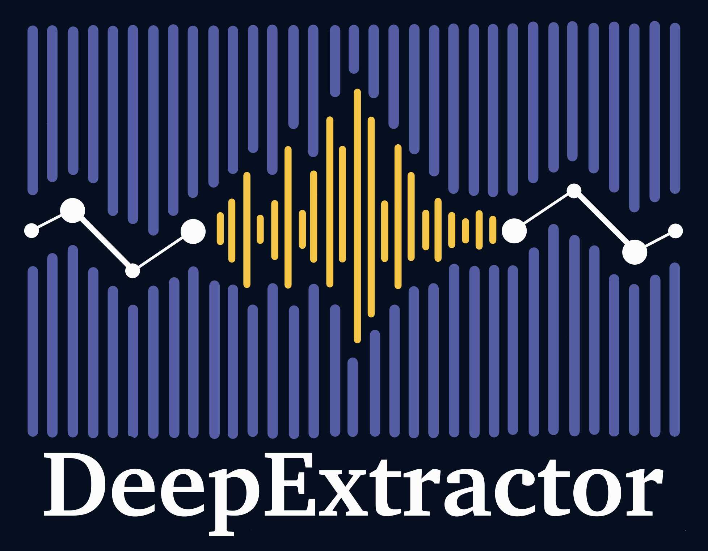

<p align="center">
  
</p>

# DeepExtractor

[](https://pypi.org/project/deepextractor/)
[](https://deepextractor.readthedocs.io/)
[](LICENSE)

Deep learning framework for reconstructing gravitational-wave signals and glitches from LIGO detector data.

Built for LIGO's O3 observing run (Hanford and Livingston detectors). Described in the paper:

> **Time-domain reconstruction of signals and glitches in gravitational wave data with deep learning**
> Dooney, Narola, Bromuri, Curier, Van Den Broeck, Caudill, Tan — *Phys. Rev. D* 112, 044022 (2025)
> [10.1103/s91m-c2jw](https://link.aps.org/doi/10.1103/s91m-c2jw)

**[Documentation](https://deepextractor.readthedocs.io/)** | **[GitHub](https://github.com/tomdooney95/deepextractor)** | **[PyPI](https://pypi.org/project/deepextractor/)**

---

## How it works

LIGO strain data contains both astrophysical signals and instrumental glitches — short-duration noise transients that can mimic or obscure gravitational-wave events. DeepExtractor frames glitch reconstruction as a supervised denoising problem:

```
Input:  h(t)  = background noise  +  glitch/signal
Output: n̂(t)  = predicted background
Result: ĝ(t)  = h(t) − n̂(t)   ← reconstructed glitch or signal
```

The model is a **U-Net** operating on STFT spectrograms (magnitude + phase). The default model, `DeepExtractor_257`, uses a 4-level U-Net with feature maps `[64, 128, 256, 512]`.

---

## Installation

```bash
pip install deepextractor
```

Requires Python ≥ 3.10 and PyTorch ≥ 2.1. Pretrained weights are downloaded automatically from Hugging Face Hub on first use — no manual step required.

**Install from source:**

```bash
git clone https://github.com/tomdooney95/deepextractor.git
cd deepextractor
pip install -e ".[dev]"
```

---

## Quickstart

```python
import numpy as np
import deepextractor

# Load model (Trained on the projected O4 noise curves)
model = deepextractor.DeepExtractorModel()

# Reconstruct — extract the transient from noisy strain
noisy_strain = np.random.randn(8192)             # replace with real data
reconstructed = model.reconstruct(noisy_strain)  # extracted signal
background    = model.background(noisy_strain)   # noise estimate

# One-liner convenience function
reconstructed = deepextractor.reconstruct(noisy_strain)
```

Two pretrained variants are available:

| Variant | Use case |
|---|---|
| `bilby_noise` (default) | Simulated LIGO/Virgo noise, injection studies |
| `real_noise` | Real LIGO O3 detector data |

---

## Glitch reconstruction dataset

A dataset of 35,000 DeepExtractor reconstructions across seven LIGO O3 glitch classes
(Blip, Fast Scattering, Koi Fish, Low Frequency Burst, Scattered Light, Tomte, Whistle)
is available on HuggingFace:
[tomdooney/deepextractor-glitch-reconstructions](https://huggingface.co/datasets/tomdooney/deepextractor-glitch-reconstructions)

```python
from deepextractor.data import download_glitch_data

paths = download_glitch_data("data/glitches/")
# paths["samples"]     → (35000, 8192) whitened waveforms
# paths["labels"]      → (35000, 7)   one-hot class labels
# paths["label_order"] → class names in label-column order
```

---

## Bundled dataset

The package ships a sample of the [GravitySpy LIGO O3a high-confidence catalogue](https://doi.org/10.5281/zenodo.1476551) at `assets/data_o3a_sample.csv` — 10 H1 examples per glitch class (17 classes, 170 rows total), SNR > 15.

```python
import pandas as pd
import importlib.resources as resources

with resources.path("deepextractor", "assets") as assets:
    df = pd.read_csv(assets / "data_o3a_sample.csv")

print(df["label"].value_counts())
```

---

## CLI tools

```bash
# Train a model
deepextractor-train --model DeepExtractor_257 --data-dir data/spectrogram_domain/

# Generate training data
deepextractor-generate --output-dir data/ --num-train 250000

# Convert time-domain data to spectrograms
deepextractor-specgen --input-dir data/time_domain/ --output-dir data/spectrogram_domain/

# Evaluate a trained model
deepextractor-evaluate --model DeepExtractor_257 --checkpoint-dir checkpoints/ --data-dir data/
```

---

## Citation

```bibtex
@article{s91m-c2jw,
  title     = {Time-domain reconstruction of signals and glitches in gravitational wave data with deep learning},
  author    = {Dooney, Tom and Narola, Harsh and Bromuri, Stefano and Curier, R. Lyana and Van Den Broeck, Chris and Caudill, Sarah and Tan, Daniel Stanley},
  journal   = {Phys. Rev. D},
  volume    = {112},
  issue     = {4},
  pages     = {044022},
  numpages  = {24},
  year      = {2025},
  month     = {Aug},
  publisher = {American Physical Society},
  doi       = {10.1103/s91m-c2jw},
  url       = {https://link.aps.org/doi/10.1103/s91m-c2jw}
}
```
